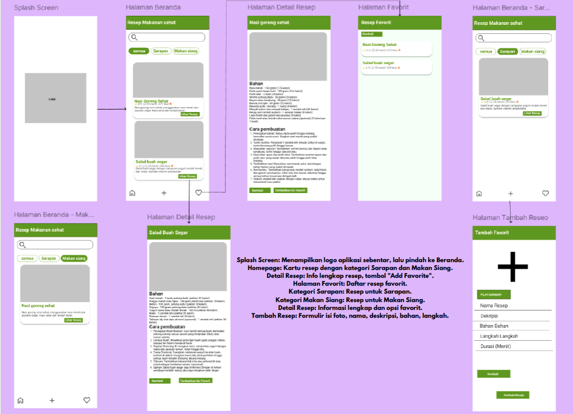
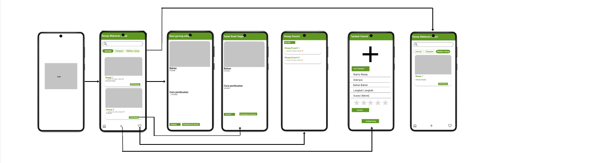
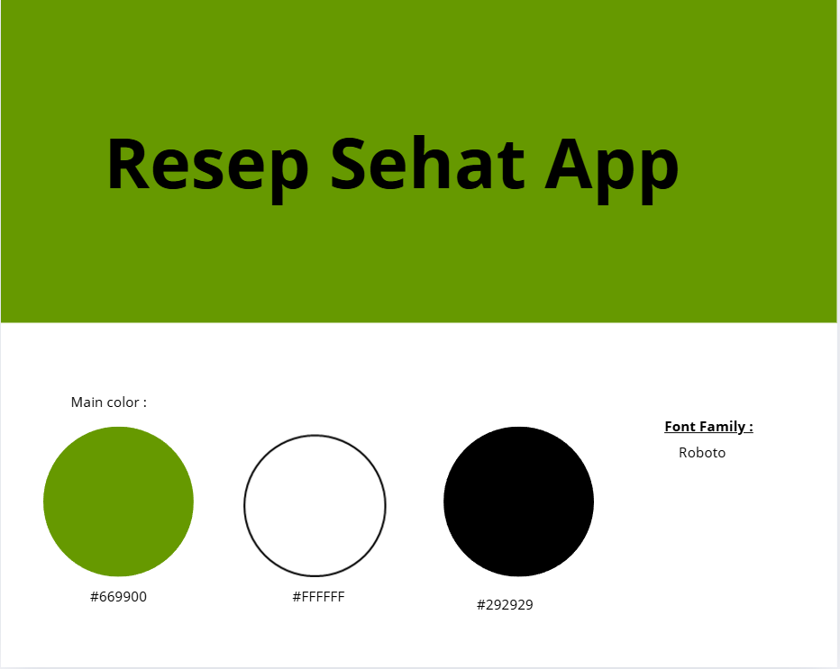
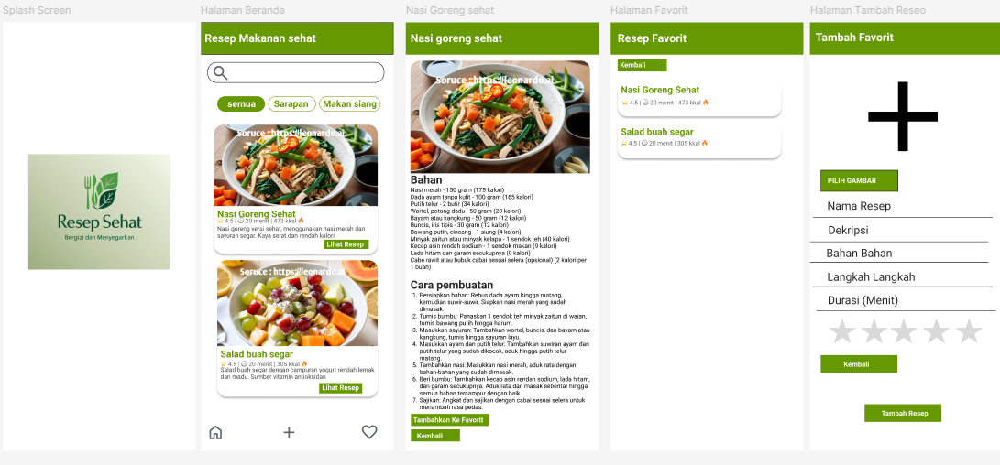
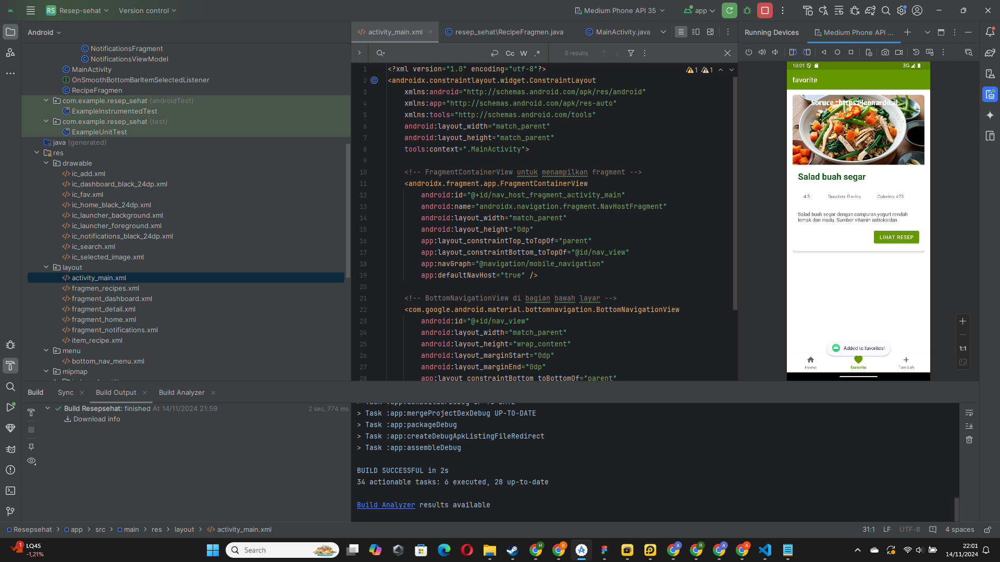
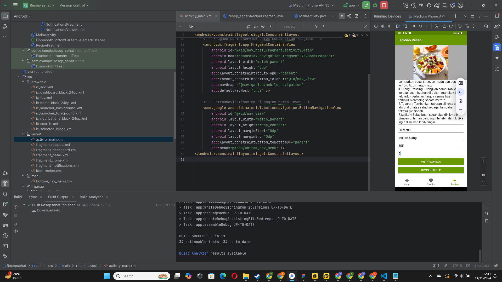
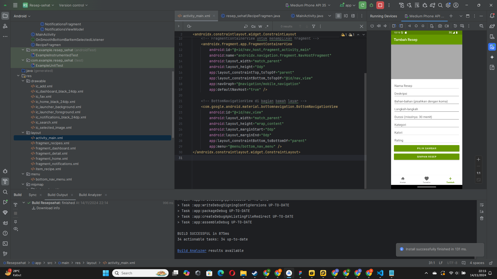
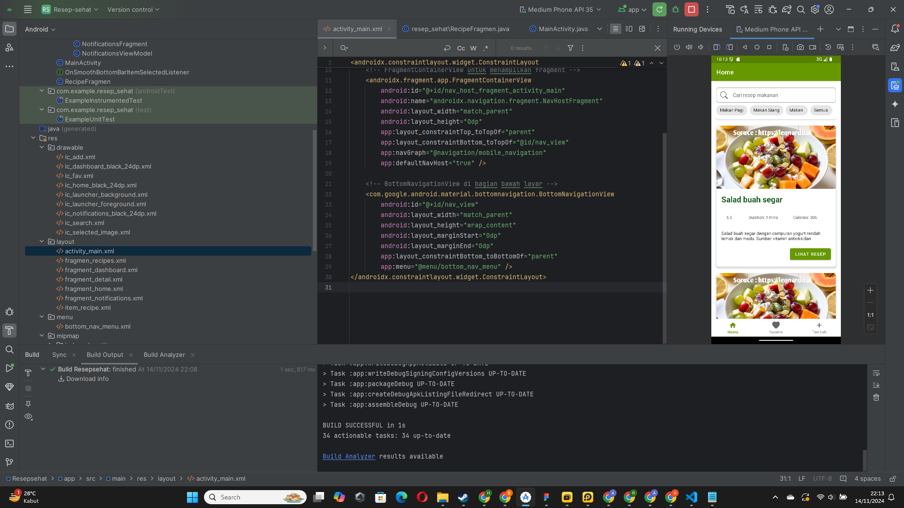

#Uts Pemogramanan Mobile
# 🍲 Resep Sehat 

  
  

## 👤 Profil Mahasiswa

| Atribut           | Keterangan                    |
| ----------------- | ----------------------------- |
| **Nama**          | Alvin Alfandy                       |
| **NIM**           | 312310473                   |
| **Kelas**         | TI.23.A.5                     |
| **Mata Kuliah**   | Pemrograman Mobile 1          |
| **Dosen Pengampu** | Donny Maulana S.kom., M.M.S.I |

---

## 🥗 Selamat Datang di Aplikasi **Resep Sehat**!
**Resep Sehat** adalah aplikasi Android yang dirancang untuk membantu Anda menemukan, menambahkan, dan menyimpan berbagai resep masakan sehat. Aplikasi ini memungkinkan Anda untuk mengelola resep dengan mudah dan menyesuaikannya dengan preferensi kesehatan Anda.

### 🎯 Fitur Utama:
1. **Beranda**: Temukan berbagai resep sehat untuk memulai perjalanan kuliner sehat Anda.
2. **Favorit**: Simpan resep-resep favorit Anda agar mudah diakses kembali.
3. **Detail Resep**: Lihat informasi lengkap tentang bahan-bahan dan langkah pembuatan untuk setiap resep.
4. **Tambah Resep Baru**: Tambahkan resep masakan sehat Anda sendiri dengan mudah dan simpan di aplikasi.

---

## 📝 Storyboard

## 🎨 Mockup

## 💻 UI/UX Preview

---

# 📱 Fitur-Fitur Aplikasi

### 1. **Beranda**
 
   Halaman beranda berfungsi sebagai pengantar bagi pengguna untuk mulai menjelajahi resep yang tersedia, dengan tampilan yang menarik dan navigasi intuitif.

   - **Navigasi Mudah**: Akses cepat ke resep-resep sehat.
   - **Deskripsi Singkat**: Temukan rekomendasi resep terbaik untuk pilihan sehat Anda.

### 2. **Favorit**

   Kumpulkan resep favorit Anda dalam satu tempat untuk akses lebih cepat.

   - **Simpan Resep Favorit**: Tandai resep yang Anda sukai untuk memudahkan pencarian di lain waktu.
   - **Daftar Favorit**: Akses koleksi resep favorit Anda kapan saja.

### 3. **Detail Resep**

   Halaman detail ini memberikan informasi lengkap tentang bahan-bahan dan langkah-langkah pembuatan.

   - **Deskripsi Resep**: Informasi lengkap mengenai bahan dan langkah pembuatan.
   - **Foto Resep**: Tampilkan gambar hasil akhir dari resep untuk inspirasi Anda.

### 4. **Tambah Resep**

   Fitur ini memungkinkan pengguna untuk menambahkan resep secara manual, melengkapi informasi seperti bahan, instruksi, dan foto.

   - **Tambah Informasi Resep**: Isi detail resep termasuk bahan-bahan dan langkah-langkah.
   - **Upload Gambar**: Unggah gambar resep untuk dokumentasi yang lebih menarik.

---

---

